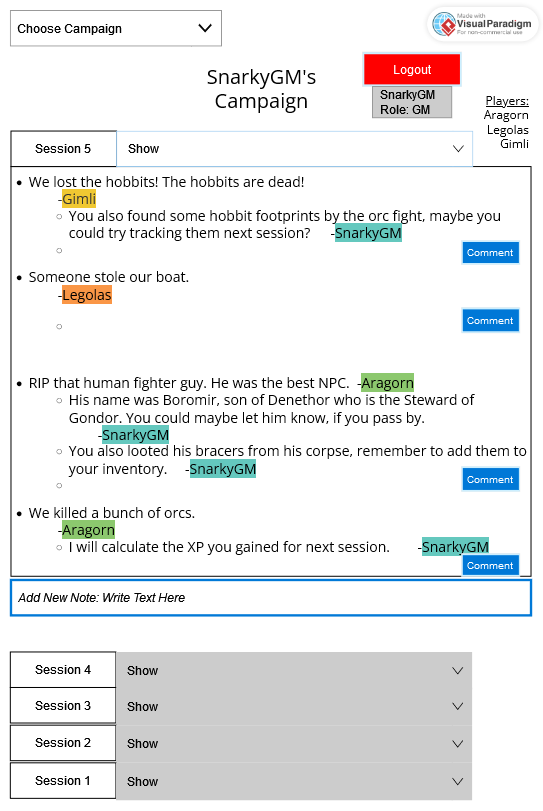
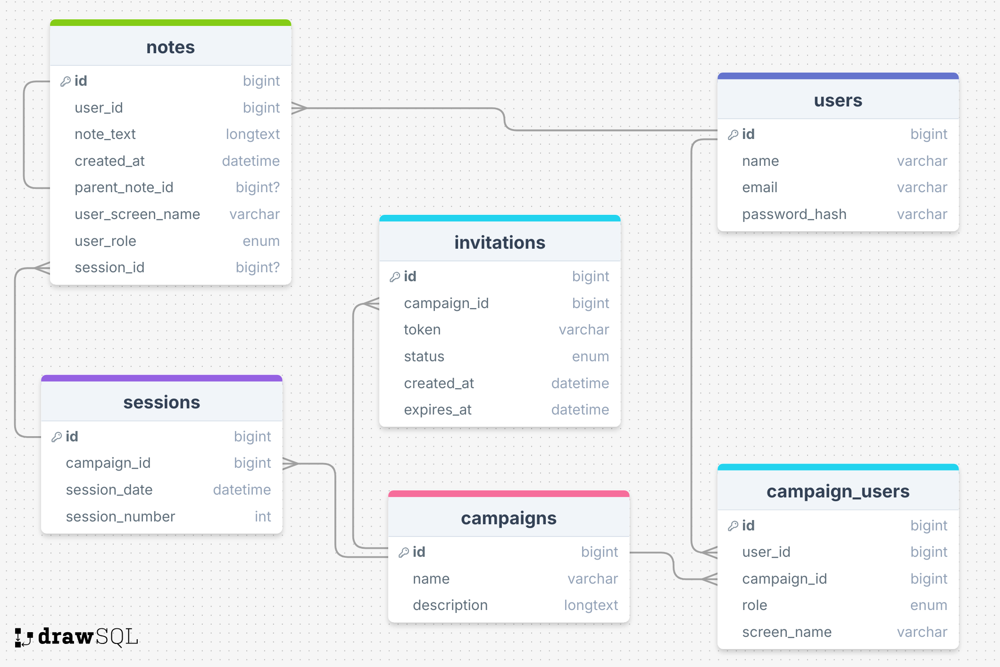

# RGP Session Notes App

The RPG Session Notes App is a web application designed for tabletop RPG enthusiasts to keep track of their campaign sessions. It allows Game Masters (GMs) and players to collaborate, share notes, and stay organized throughout their campaign. The app enables GMs to create campaigns, invite players via shareable links, and add detailed notes for each session. Players can also contribute notes and comments, while keeping their in-campaign identities separate from their global user profiles.

### Key Features:

- **Campaign Management**: GMs can create campaigns, invite players with shareable links, and manage ongoing sessions.
- **Session Notes**: Both GMs and players can add notes for each session, with the option for comments and discussions around specific notes.
- **Distinct Roles**: GM and player notes are visually distinct, making it easy to differentiate contributions.
- **Custom Screen Names**: Users can set different display names for each campaign, preserving immersion across multiple campaigns.
- **Invitation Links**: GMs can invite players with expiration-based links that can be shared with groups for easy onboarding.

This app aims to streamline RPG session tracking, so you can focus on the adventure without losing track of important campaign details!

## Planning

Main Campaign and Notes view sketch:

Database structure schema:

